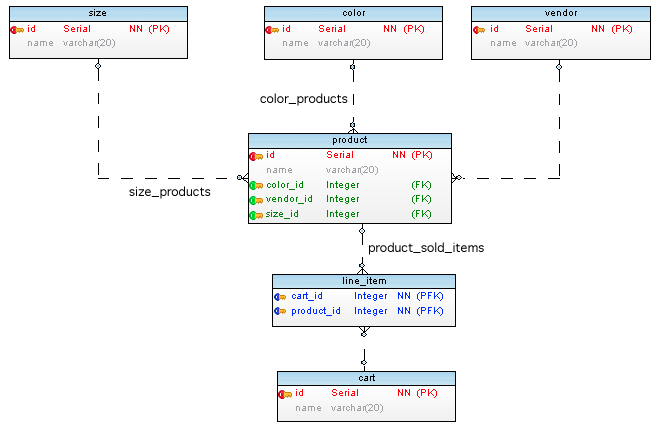

## Relation Names

Actually database systems does not have relations. They have foreign key constraints. Relation is a concept to describe relationships between tables based on foreign key constraints. **pg-structure** provides [O2MRelation](api/O2MRelation.md), [M2MRelation](api/M2MRelation.md) and [M2ORelation](api/M2ORelation.md) classes relations.

Since relations are not real objects defined in database systems, they do not have names. Relation names used in ORM systems should generated somehow. Naming is already very complex mental process and there are multiple methods and preferences to name relations. **pg-structure** provides more than one strategy to generate names for different preferences and to reduce chance of conflicting names. They aren't perfect, but at least does the job for most of the time.

### Strategies

To name relations **pg-structure** provides strategies below. All strategies tries to guess inflection of table names such as snake_case or CamelCase with a simple test. If first letter is capital, then it is assumed CamelCase, snake_case otherwise. Generated names use guessed inflection.

When `generateName()` method is called without any strategies, **pg-structure** chooses simple strategy. If there are more than one relation between same tables, additional relations are named using complex strategy to prevent conflicts.

 <span id="exampleSchema"></span>Below is a database schema as an example:

```
 size -------------------
 id (PK)                |  ---------------------------< line_item >------------ cart
 name                   |  |                            product_id (PFK)        id (PK)
                        |  |                            cart_id    (PFK)        name
                        ^  |
 color -------------< product >------------- vendor
 id (PK)              id        (PK)         id (PK)
 name                 name                   name
                      color_id  (FK)
                      size_id   (FK)
                      vendor_id (FK)
 
```
 
 Below is the same schema as image:
 


O2M examples are given for:

`product ---< line_item` (i.e. `product.o2mRelations.values()[0].generateName('simple')`).

M2O examples are given for:

`line_item >--- product` (i.e. `lineItem.m2oRelations.values()[0].generateName('simple')`).

M2M examples are given for:

`product ---< line_item >--- cart` (i.e. `product.m2mRelations.values()[0].generateName('simple')`).

| Relation | Form | Strategy | Description | Example |
| --- | --- | --- | --- | --- |
| O2M | simple | Plural | Target table name. | line_items |
| O2M | complex | Plural | Constraint name, but source table name stripped from beginning. | sold_items | 
| M2O | simple | Singular | Target table name. | product |
| M2O | complex | Singular| First foreign key column name. If 'id' string is present, it is stripped, otherwise 'related' prefix added. | product |
| M2M | simple | Plural | Target table name. | carts |
| M2M | complex | Plural | Join Table Name + Foreign Key to Target Table. If 'id' string is present, it is stripped, otherwise 'related' prefix added. | line_item_carts |

### Overriding

Even using complex strategy, it is sometimes impossible to generate unique names. In that case it is possible to override generated names by providing clues to **pg-structure** in database.

#### Using Constraint Description Data (!EXPERIMENTAL)

You can use constraint's description in PostgreSQL. Description data is fetched from constraint description. In short, you can put JSON data between `[pg-structure]` and `[/pg-structure]` tags in constraint description.

([See Description Data in Concepts](concepts.md)). It is a non-strict JSON data. **pg-structure** uses given names in description data.

Example:

```
[pg-structure]
{
    name: {
        m2m: my_custom_name
    }
}
[/pg-structure]
```

| Relation | JSON Key | Notes |
| --- | --- | --- |
| O2M | `name.hasMany` or `name.o2m` | Used as it is |
| M2O | `name.belongsTo` or `name.m2o` | Used as it is |
| M2M | `name.belongsToMany` or `name.m2m` | Used as: Given String + Target Table Name |

#### Using Constraint Name as CSV (!EXPERIMENTAL)

You can also name your constraints in database as a CSV. If constraint name includes comma, **pg-structure** assumes it is CSV value to provide clue for relation names.

| CSV | Description | Notes |
| --- | --- |--- |
| 1 | One to many relation name | Used as it is |
| 2 | Many to one relation name | Used as it is |
| 3 | Prefix for many to many relations | Used as: Given String + Target Table Name |

Example:

```
         sold_items, item, sku                cart_goods, basket, bag
product ------------------------< line_item >------------------------- cart

```

| CSV | From | To | Type | Name |
| --- | --- |--- | --- | --- |
| 1 | product | line_item | O2M | sold_items |
| 2 | line_item | product | M2O | item |
| 3 | product | cart | M2M | sku_carts |
| 1 | cart | line_item | O2M | cart_goods |
| 2 | line_item | cart | M2O | basket |
| 3 | cart | product | M2M | bag_products |

### Priority

Relation naming function prioritizes different methods as follows:

| # | Method | Notes |
| --- | --- | --- |
| 1 | Strategy from function parameter | If parameter is given such as `rel.generateName('simple')`, uses given strategy. |
| 2 | Constraint Name CSV | **PRO:** May easy to use in ERD tools. **CON:** Invasive, seen in DB error messages. |
| 3 | Constraint Description Data | **PRO:** Non invasive. **CON:** One more step in ERD tools. |
| 4 | Simple Stratgey | If there is no previous relation between same tables. |
| 5 | Complex Strategy | Last resort. |

#### Module's Author's Practices

Use `generateName()` without parameters, and if you don't like generated names for a specific relation, use description data in that constraint's description.

The reason of preferring description data over constraint name is that when foreign key violation occurs, PostgreSQL error messages contains constraint names and long CSV names may be confusing.